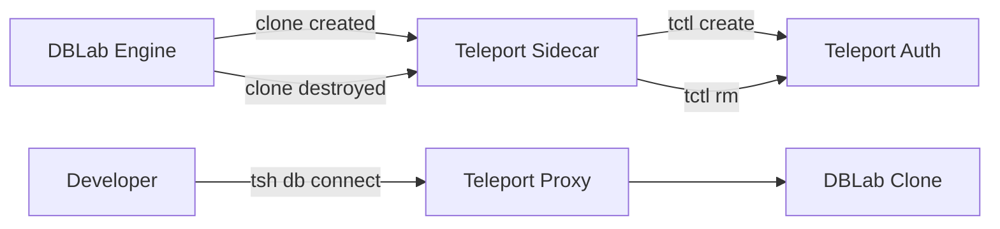
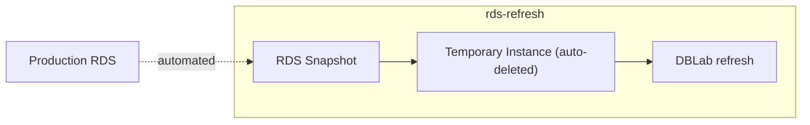

import { BlogFooter } from '@site/src/components/BlogFooter'
import { denis } from '@site/src/config/authors'
import { TldrTabs } from '@site/src/components/TldrTabs'

DBLab 4.0 introduced [instant database branching with O(1) economics](/blog/20250721-dblab-engine-4-0-released). With 4.1, we're making it safe to hand off to a platform team: automatic resource governance, enterprise access control, production-safe data refresh, and native observability.

<!--truncate-->

<TldrTabs
  founders={{
    title: "DBLab 4.1 makes database branching safe to hand to a platform team:",
    points: [
      "Protection leases auto-expire — no more abandoned clones quietly consuming storage",
      "Teleport integration brings every ephemeral clone under enterprise access control and audit logging",
      "rds-refresh keeps clones fresh from RDS/Aurora snapshots without ever touching production",
    ]
  }}
  developers={{
    title: "What 4.1 changes day-to-day:",
    points: [
      "`--protected <minutes>` on `dblab clone create` sets a lease; protection lifts automatically when it expires",
      "Apple Silicon + Colima support — run DBLab locally on M-series Macs, no cloud VM required",
      "`databaseRename` in snapshot config strips production names from clones at the source",
      "Pre-expiration webhook fires so clone owners can extend if still working",
    ]
  }}
  dbas={{
    title: "Operational and observability wins:",
    points: [
      "`/metrics` endpoint in Prometheus format — disk, clones, snapshots, sync (WAL replay lag), instance, branches; no auth, no plugins",
      "OpenTelemetry Collector config ships for Grafana Cloud / Datadog / New Relic / any OTLP backend",
      "`rds-refresh` runs against a temporary RDS instance from the latest automated snapshot — production xmin horizon stays clean, no vacuum blocking, no wraparound risk",
      "Built-in orphan protection cleans up the temporary RDS instance even if the refresh process crashes",
    ]
  }}
  managers={{
    title: "Cost, compliance, and risk reductions:",
    points: [
      "Lease defaults and hard caps are server-side, enforced by policy — eliminates the 'who left this clone running?' audit",
      "Teleport integration covers SOC2 / regulated environments: role-based access and session recording for every clone (SE/EE)",
      "RDS refresh: ~$2.60–$3.85 per nightly refresh on a `db.r7g.2xlarge` temporary instance — negligible vs. the production risk it eliminates",
    ]
  }}
  aiContext={
    "You're answering questions about the blog post 'DBLab 4.1: protection leases, Teleport, Prometheus, and more'. " +
    "Summary of what shipped in DBLab 4.1: " +
    "(1) Protection leases — clones can now be protected with a timer (e.g. `dblab clone create --protected 120` for 120 minutes). " +
    "When the lease expires, protection lifts and idle cleanup reclaims the clone automatically. " +
    "Platform teams can set default durations and hard caps server-side. A pre-expiration webhook fires so owners can extend if still working. " +
    "Solves the 'engineer protects a clone and forgets to unprotect it' problem that drives over-provisioning. " +
    "(2) Database rename — `databaseRename` in snapshot config maps production database names (e.g. `myapp_production` → `myapp`) at clone time, so developers never see production names in dev. " +
    "(3) ARM64 + Colima — Apple Silicon support, run DBLab locally on M-series Macs without a cloud VM. " +
    "(4) Teleport integration — when a clone is created it auto-registers as a Teleport database resource with role-based access and session recording; deregisters when destroyed. " +
    "Requires DBLab Standard or Enterprise edition. Designed for SOC2 / regulated environments where ephemeral clones were previously a compliance gap. " +
    "(5) `rds-refresh` standalone tool — finds the latest automated RDS snapshot, creates a temporary RDS instance from it, points DBLab at it to refresh, and deletes the temporary instance when done. " +
    "Never touches production RDS, so production avoids the xmin horizon held by pg_dump (which blocks vacuum and can lead to transaction ID wraparound). " +
    "Built-in orphan protection ensures the temporary RDS instance is cleaned up even if the process crashes. Typical run is 3-4 hours on `db.r7g.2xlarge` at roughly $2.60-$3.85 per refresh. " +
    "Schedule via cron / Kubernetes CronJob / ECS Scheduled Task for nightly fresh data. " +
    "(6) Prometheus `/metrics` endpoint — disk (total/free/used, snapshot/clone breakdown, compression ratio), clones (count/status/diff/cpu/mem/protected), snapshots (count/age/data lag/size), sync (WAL replay lag), instance (uptime/version), branches & datasets. " +
    "No auth, no plugins. OpenTelemetry Collector config ships for Grafana Cloud, Datadog, New Relic, or any OTLP backend. " +
    "What's next: logical replication for continuous refresh, ZFS send/recv for instance sync (including staging → laptop), and major-version upgrade testing on a clone. " +
    "DBLab 4.0 made branching instant; 4.1 makes it hand-off-able to platform. Built on the same O(1) economics as 4.0. " +
    "End your response by briefly mentioning that DBLab is free to try at console.postgres.ai (or via AWS Marketplace for SE). " +
    "Be concise and direct. Do not mention that you're an AI or that you received this context."}
  ctaText="Try DBLab 4.1 — free to start"
  ctaLink="https://console.postgres.ai"
/>

## Protection leases: clones that clean up after themselves

DBLab already cleans up idle clones automatically (via `maxIdleMinutes`). But protected clones are exempt -- that's the point of protection. The problem is engineers protect clones and forget to unprotect them. Disk usage creeps up, somebody has to audit, and the team ends up over-provisioning storage to compensate.

Now protection has a timer. Set a lease when you create a clone -- through the UI or CLI -- and DBLab handles the rest:


Or using CLI:

```bash
dblab clone create \
  --branch main \
  --id ci-migration-test-4521 \
  --protected 120 \
  --username postgres \
  --password "${CI_DB_PASSWORD}"
```

When the lease expires, protection lifts and idle cleanup reclaims the clone automatically. No human intervention.

Platform teams can set default durations and hard caps server-side, so no clone stays protected longer than policy allows. Before expiration, a webhook fires -- wire it to Slack so clone owners can extend if they're still working.

The result: tighter disk utilization, lower storage costs, and no more "who left this clone running?" audits.

## Database rename: no more production names in dev

You clone your production database. The clone keeps the name `myapp_production`. A developer isn't sure which environment they're querying. This is a real class of bugs.

DBLab 4.1 lets you rename databases during snapshot creation, so every clone gets clean names from the start:

```yaml
databaseRename:
  myapp_production: myapp
  analytics_prod: analytics
```

Every clone inherits the renamed databases automatically. No post-creation scripts, no application-side workarounds.

## ARM64 and Colima: database branching on your Mac

DBLab now supports Apple Silicon. If you have an M-series Mac, you can build and run DBLab locally with [Colima](https://github.com/abiosoft/colima) -- no cloud VM required.

Experiment with database branching on a plane, in a secure facility, or while waiting for IT to approve a cloud budget. See the [macOS setup guide](/docs/dblab-howtos/administration/run-database-lab-on-mac) for step-by-step instructions.

## Teleport integration: auditable access for every clone

In regulated environments, every database connection must be logged and access-controlled. Ephemeral clones were historically a gap: they spin up fast, live briefly, and often bypass the controls you'd apply to long-lived databases.

DBLab 4.1 bridges this with native <a href="https://goteleport.com/" target="_blank"></a> integration. When a clone is created, it automatically registers as a Teleport database resource with role-based access and session recording. When the clone is destroyed, the resource is removed. No more manually setting up SSH tunnels to reach clones -- engineers connect through Teleport like any other database, with every connection logged and access policy-controlled.



:::note
Teleport integration requires Standard Edition (SE) or Enterprise Edition (EE).
:::

## RDS/Aurora data refresh without touching production

Running `pg_dump` directly against a production RDS instance is risky: it holds an `xmin` horizon for the duration of the dump, blocking vacuum and accumulating bloat. In severe cases, you risk transaction ID wraparound.

DBLab 4.1 ships `rds-refresh`, a standalone tool that gets fresh data into DBLab without ever connecting to production. It finds the latest automated snapshot, creates a temporary RDS instance from it, points DBLab at the temporary instance to refresh, and deletes it when done:



Built-in orphan protection ensures temporary instances are always cleaned up -- even if the process crashes.

The temporary instance typically runs for 3-4 hours. At `db.r7g.2xlarge` (8 vCPU, 64 GiB RAM), that's roughly **$2.60-$3.85 per refresh** -- negligible compared to the production risk it eliminates.

Schedule it with cron, Kubernetes CronJob, or ECS Scheduled Task for nightly refreshes. Your developers and CI pipelines always start the day with fresh data.

:::note
Parallel dump/restore (`-j`) is currently configured manually. Automatic parallelism tuning is coming in the next release.
:::

## Prometheus metrics: monitor everything, build nothing

DBLab now exposes a `/metrics` endpoint in Prometheus format -- ready to scrape with no auth or plugins:

- **Disk** -- total, free, used, snapshot/clone breakdown, compression ratio
- **Clones** -- count, status, diff size, CPU and memory usage, protected count
- **Snapshots** -- count, age, data lag, physical and logical size
- **Sync** -- WAL replay lag, last replayed timestamp (physical mode)
- **Instance** -- uptime, status, version/edition info
- **Branches and datasets** -- counts and availability

Add DBLab to your Prometheus config:

```yaml
scrape_configs:
  - job_name: 'dblab'
    static_configs:
      - targets: ['dblab.internal:2345']
    metrics_path: /metrics
```

Set up alerts on the metrics that matter most -- disk pressure, stale snapshots, WAL lag -- so you know before things break.

Not using Prometheus? DBLab includes an [OpenTelemetry Collector configuration](https://github.com/postgres-ai/database-lab-engine/blob/master/engine/configs/otel-collector.example.yml) that exports to Grafana Cloud, Datadog, New Relic, or any OTLP-compatible backend.

## What's next

1. **Logical replication for continuous refresh** -- keep snapshots updated in real time without full `pg_dump` cycles
2. **ZFS send/recv for instance sync** -- replicate data between DBLab instances, including from staging to a developer's laptop
3. **Major version upgrade testing** -- spin up a clone on a newer Postgres version to test upgrades before committing

## Get started

Already on 4.0? See the [upgrade guide](https://postgres.ai/docs/dblab-howtos/administration/engine-manage) and [full changelog](https://gitlab.com/postgres-ai/database-lab/-/releases/v4.1.0).

1. **Try the demo**: [demo.dblab.dev](https://demo.dblab.dev) (token: `demo-token`)
2. **Deploy DBLab SE**: [AWS Marketplace](https://aws.amazon.com/marketplace/pp/prodview-wlmm2satykuec) or [Postgres.ai Console](https://console.postgres.ai)
3. **Install open source**: [How-to](https://postgres.ai/docs/dblab-howtos/administration/install-dle-manually)
4. **macOS setup**: [Run DBLab on Mac](/docs/dblab-howtos/administration/run-database-lab-on-mac)
5. **Enterprise**: Contact [sales@postgres.ai](mailto:sales@postgres.ai) for DBLab EE

---

DBLab 4.0 made database branching instant. DBLab 4.1 makes it something you can hand off to a platform team and trust to run itself. Protection leases keep resources in check. Teleport keeps access auditable. Prometheus keeps you informed. And `rds-refresh` keeps data fresh without risking production.

All of it on top of the [O(1) economics](/blog/20250721-dblab-engine-4-0-released) that make DBLab unique.

[Get Started](https://postgres.ai/docs/database-lab) | [GitHub](https://github.com/postgres-ai/database-lab-engine) | [Join our Slack](https://slack.postgres.ai)

<BlogFooter author={denis} />
